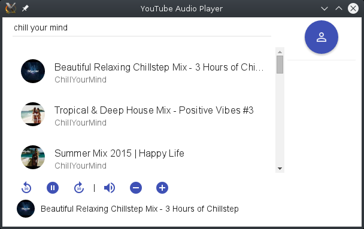

#YouTube Audio Player - Simple



It is a small nice distraction-free YouTube Audio Player

## Features

- Search Musik on YouTube
- Play your Playlists
- Create new Playlists
- Add new Musik to Playlists
- Login on Google/YouTube over Google API

## Development:

### getting started

```
npm install
sudo npm install
sudo npm install electron-prebuilt -g
npm run build
npm run electron
```

### set in development
run translater: `npm run watch`
run application: `npm run electron`

## Build:
linux x64: 
```
electron-packager . YTplayer --platform=linux --arch=x64 --version=0.36.4 --overwrite --ignore="node_modules/(electron-packager|electron-prebuilt)" --ignore=release
```
OR `electron-packager-interactive`


## How it works


## ToDo

- Setup View (global over all)
- Global Keyboard binding
 - store & load to/from hotkeys file
 - register hotkeys with nw.js (https://github.com/nwjs/nw.js/wiki/shortcut)
- Get all Playlist and not only that which are owned by the user
- Try to play all YouTube Videos - also that which are marked as not to play on a not YouTube page
- Stream to ChromeCast/FireTV-Stick
 - https://www.npmjs.com/package/chromecasts | https://github.com/mafintosh/playback